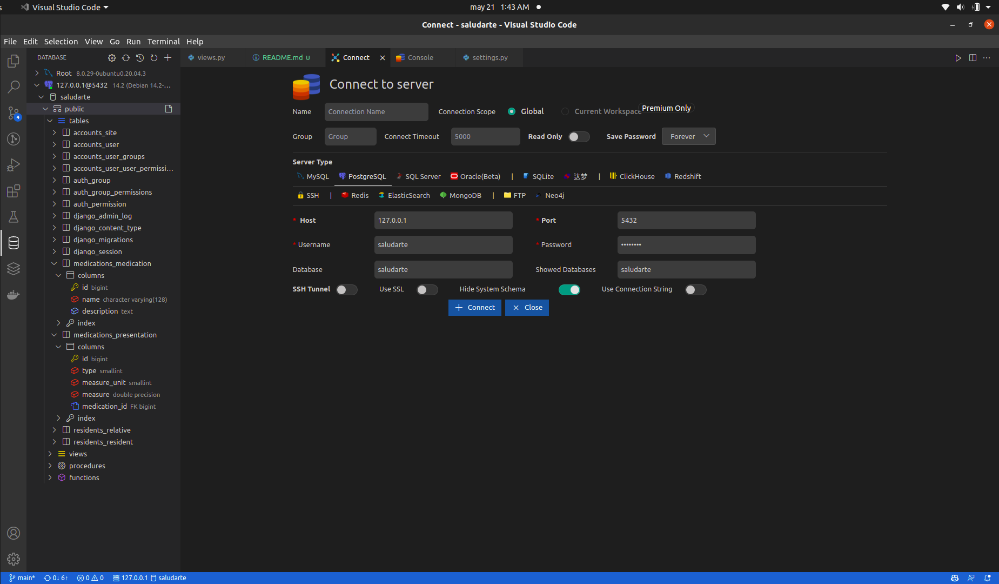
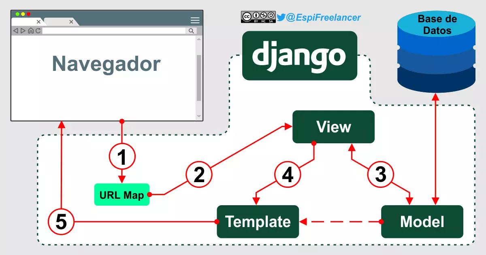
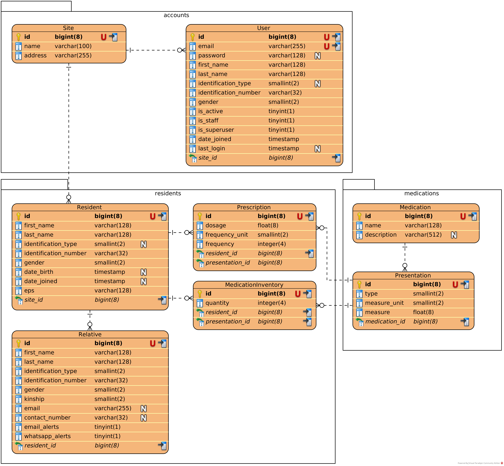

# Saludarte


Este es el punto de partida de la aplicación web de Saludarte. Te recomiendo
seguir la tabla de contenidos en orden para que puedas ponerte al día con el
código fuente.

# Tabla de contenidos

- [Antes de empezar](#antes-de-empezar)
- [Introducción](#introducción)
  - [Funcionalidades ofrecidas](#funcionalidades-ofrecidas)
- [Tech Stack](#tech-stack)
  - [Back-end](#back-end)
  - [Front-end](#front-end)
- [Configuración](#configuración)
  - [Configuración de Docker](#configuración-de-docker)
  - [Estructura del proyecto](#estructura-del-proyecto)
  - [Otras configuraciones](#otras-configuraciones)
- [Instalación](#instalación)
  - [Recomendaciones](#recomendaciones)
  - [Pre-requisitos](#pre-requisitos)
    - [Comandos](#comandos)
    - [Docker](#docker)
    - [Git](#git)
  - [Instalando la aplicación](#instalando-la-aplicación)
  - [Ejecutando la aplicación](#ejecutando-la-aplicación)
- [Entendiendo el código](#entendiendo-el-código)
  - [El archivo de entorno `.env`](#el-archivo-de-entorno-env)
  - [El archivo de compose override `docker-compose.override.yml`](#el-archivo-de-compose-override-docker-composeoverrideyml)
  - [El archivo de scripts `./run`](#el-archivo-de-scripts-run)
  - [Django](#django)
    - [Estructura de carpetas](#estructura-de-carpetas)
    - [Configuración de Django](#configuración-de-django)
    - [Arquitectura de Django](#arquitectura-de-django)
    - [Aplicaciones de Django](#aplicaciones-de-django)
    - [Aplicaciones del proyecto](#aplicaciones-del-proyecto)
    - [Modelos del proyecto](#modelos-del-proyecto)
- [Licencia](#licencia)
- [Atribuciones](#atribuciones)

# Antes de empezar

Si estas leyendo esto, es porque seguramente acabas de apadrinar el repositorio.
Este documento pretende servir de punto de partida para que logres configurar el
proyecto. Sin embargo, antes de empezar, es importarte que cuentes con algunos
conceptos enumerados a continuación, para que entiendas mejor cómo funciona el
proyecto:

1. Espero que hayas hecho leído brevemente los documentos que quedaron en el
   repositorio de trabajo con Saludarte para el semestre 2022-10, y así tengas
   una idea de lo que se espera de este proyecto.
2. Debes contar con conocimientos básicos de desarrollo en Python. Si nunca has
   utilizado Python, no espero que encuentres muchos problemas porque es un
   lenguaje bastante sencillo y de alto nivel, por lo cual podrás agarrar los
   conceptos rápidamente.
3. Debes contar con conocimientos básicos de desarrollo web como: HTML, CSS,
   JavaScript, bases de datos, arquitecture cliente-servidor.
4. Debes contar con conocimientos básicos de Django, el framework de Python que
   utilizamos para el desarrollo de la aplicación. Mi recomendación es realizar
   el
   [tutorial completo de Django](https://docs.djangoproject.com/en/4.0/intro/tutorial01/).
   También puedes referirte a la
   [documentación oficial de Django](https://docs.djangoproject.com/en/4.0/).
5. Debes contar con conocimientos muy básicos de Docker. Si nunca lo has
   utilizado, no te preocupes porque realmente ya está configurado.

# Introducción

La aplicación de Saludarte permite a los usuarios de la organización llevar el
manejo de los inventarios de medicamentos de los residentes.

## Funcionalidades ofrecidas

El término gestión significa funcionalidad CRUD (Create, Read, Update, Delete).

**Autenticación y cuentas**

- Inicio de sesión
- Recuperación y cambio de contraseña
- Visualización del perfil
- Edición del perfil

**Gestión de usuarios**

**Gestión de residentes**

**Gestión de medicamentos**

**Manejo de prescripciones**

- Asignación, modificación o eliminación de la prescripción a los residentes

**Manejo de inventarios**

- Visualización de las reservas de medicamentos de los residentes
- Ingreso de medicamentos a los residentes
- Egreso de medicamentos de los residentes

# Tech Stack

La aplicación está desarrollada con [Django 4.0](https://www.djangoproject.com/)
y Python 3.10. Además, se utiliza [Docker](https://www.docker.com/) como
herramienta de CI/CD.

## Back-end

- [PostgreSQL](https://www.postgresql.org/) - Base de datos relacional utilizada
- [Redis](https://redis.io/) - Servidor de caché y broker de mensajes entre la
  aplicación y los workers (Celery)
- [Celery](https://github.com/celery/celery) - Manejo de tareas asíncronas
  mediante workers

## Front-end

- [esbuild](https://esbuild.github.io/) - Compilador de código JavaScript
- [TailwindCSS](https://tailwindcss.com/) - Framework CSS que incluye una serie
  de clases default para crear componentes de diseño .
- [JQuery](https://jquery.com/) - Manejo del DOM.
- [DataTables](https://datatables.net/) - Tablas de datos con filtros,
  paginación, ordenación y búsqueda.

# Configuración

## Configuración de Docker

Los archivos relevantes para la configuración de docker son:

- `Dockerfile`
- `docker-compose.yml`
- `docker-compose.override.yml`

Esta configuración asegura que la aplicación se pueda ejecutar de la misma forma
en distintos entornos (desarrollo local desde el SO de cada colaborador,
servidor de producción). En la sección de instalación se explica como correr los
comandos necesarios para ejecutar la aplicación localmente.

Las imágenes (`docker images`) que se generan son:

- _saludarte_web_ + _saludarte_worker_
- _saludarte_css_ + _saludarte_js_
- _python_ from _3.10.4-slim-bullseye_
- _redis_ from _6.2.6-bullseye_
- _postgres_ from _14.2-bullseye_
- _node_ from _16.14.2-bullseye-slim_

Los contenedores (`docker ps`) donde se ejecuta la aplicación son:

| Contenedor           | Puertos                                   | Descripción                            |
| -------------------- | ----------------------------------------- | -------------------------------------- |
| _saludarte_web_      | 0.0.0.0:8000->8000/tcp, :::8000->8000/tcp | Aplicación de Django                   |
| _saludarte_worker_   | 8000/tcp                                  | Worker para ejecutar tareas asíncronas |
| _saludarte_postgres_ | 5432/tcp                                  | Base de datos PostgreSQL               |
| _saludarte_js_       |                                           | Assets de JavaScript                   |
| _saludarte_css_      |                                           | Assets de CSS                          |
| _saludarte_redis_    | 6379/tcp                                  | Caché y bróker con el worker de Celery |

- El contenedor _saludarte_web_ es el entrypoint de la aplicación. Los puertos
  indican que se está recibiendo todo tráfico de la máquina local por el puerto
  8000, y está siendo redireccionado a el puerto 8000 del contenedor.
- El contenedor _saludarte_worker_ es el worker en Celery configurado para
  ejecutar tareas asíncronas que la aplicación coloque en su cola. Está
  recibiendo tráfico por el puerto 8000.
- El contenedor _saludarte_postgres_ es el servidor de base de datos PostgreSQL.
  Está recibiendo tráfico por el puerto 5432. (En modo de desarrollo, se puede
  configurar para que redireccione todo tráfico de la máquina local a este
  puerto).
- Los contenedores _saludarte_js_ y _saludarte_css_ son los assets de JavaScript
  y CSS. Estos "sirven" los archivos de forma estática con ayuda de whitenoise.
- El contenedor _saludarte_redis_ es el servidor de caché y bróker de mensajes
  entre la aplicación y los workers (medio de comunicación entre Django y
  Celery). Está recibiendo tráfico por el puerto 6379.

## Estructura del proyecto

La estructura de carpetas del proyecto luce algo así:

```
├── assets/
│   ├── css/
│   ├── js/
│   └── static/
│       └── images/
├── bin/
├── public/
├── public_collected/
├── src/
│   ...
│   ├── __init__.py
│   └── manage.py
├── .env.example
├── docker-compose.override.yml.example
├── docker-compose.yml
├── Dockerfile
├── requirements.txt
└── run
```

- La carpeta `assets/` podría ser el paralelo del front-end de la aplicación.
  Aquí se alojan los archivos de `app.js` y `app.css` que alojan las funciones
  JS y los estilos CSS utilizados, así como otras configuraciones pertinentes.
  _En la sección del front-end se explica en profundidad como está organizado._
  - La carpeta `static/` aloja los archivos estáticos (imágenes, json, etc.).
    Aquí se encuentra también los archivos necesarios para generar el favicon.
    Las imágenes deberían alojarse en su subcarpeta correspondiente,
    preferiblemente en formato SVG.
- La carpeta `bin/` aloja algunos scripts de configuración. **Estos archivos no
  deben ser modificados**.
- Las carpetas `public/` y `public_collected/` alojan todos los archivos
  estáticos que son generados desde `assets/` (JS, CSS, imágenes, etc.) y que
  son servidos tanto por whitenoise como por los contenedores correspondientes.
  **Estos archivos son recogidos automáticamente, y no deben ser modificados.**
- La carpeta `src/` aloja todo el código fuente de la aplicación en Django.
  - Bajo la carpeta están muchas más carpetas que alojan la configuración y apps
    de Django. _En la sección de configuración de Django se explica en
    profunidad como está organizado el proyecto_.
- El archivo `.env.example` es un **ejemplo** del archivo de entorno que debe
  tener la aplicación. Los archivos de entorno alojan las variables de entorno,
  credenciales de acceso, llaves secretas, etc; y son especialmente útiles para
  separar entornos de desarrollo y producción. _En la sección de instalación se
  explica como copiar este archivo a `.env`_. **El archivo de entorno original
  NUNCA debe ser subido a VCS**.
- Los archivos de docker contienen la configuración de Docker y no hay necesidad
  de modificarlos a menos de que se cambien los contenedores utilizados.
  `docker-compose.override.yml.example` es un **ejemplo** del archivo de
  sobreescritura de Docker compose que debe tener la aplicación. Es
  especialmente útil en entornos de desarrollo. _En la sección de instalación se
  explica como copiar este archivo a `docker-compose.override.yml`_.
- Los archivos `requirements.txt` alojan las dependencias de la aplicación. _En
  la sección de manejo de dependencias se explica como manejar estos archivos_.
- El archivo `run` aloja múltiples scripts para interactuar con el proyecto. _En
  la sección de run se explica como ejecutar estos scripts_.

## Otras configuraciones

- [gunicorn](https://gunicorn.org/) - Servidor utilizado para correr la
  aplicación.
- [whitenoise](https://whitenoise.readthedocs.io/en/stable/) - Para servir los
  archivos estáticos sin la necesidad de utilizar un servicio externo (CDN,
  Amazon S3, etc.).
- [flake8](https://github.com/PyCQA/flake8) - Linter de Python para ver errores,
  warnings, etc.
- [black](https://github.com/psf/black) - Formatter de Python.
- El código fuente está en Inglés.

# Instalación

## Recomendaciones

- Aunque Docker es una herramienta muy útil para la virtualización de
  aplicaciones, y permite el desarrollo de aplicaciones sin importar cual sea el
  SO de la máquina host, aconsejo mucho al desarrollador estar utilizando un SO
  Linux que esté lo más cerca posible al ambiente de producción (ya sea una VM o
  una máquina host). Esto va a facilitar mucho la integración con el software.

- Si se va a utilizar un SO Windows, es **obligatorio** utilizar el PowerShell
  para ejecutar la aplicación. Los pasos de instalación que se presentarán a
  continuación corren nativamente en sistemas \*NIX, pero no en Windows ni su
  CMD (Command Prompt).

- Se aconseja utilizar VSCode como editor de texto / IDE. Así mismo, se
  recomienda utilizar las siguientes extensiones para poder tener una buena
  integración de código (las extensiones pueden ser buscadas en el marketplate
  por su ID):

  | Extensión                   | Publicador         | ID                           |
  | --------------------------- | ------------------ | ---------------------------- |
  | Python\*                    | Microsoft          | ms-python.python             |
  | Pylance\*                   | Microsoft          | ms-python.pylance            |
  | Django\*                    | Baptiste Darthenay | batisteo.vscode-django       |
  | GitLens                     | GitKraken          | eamodio.gitlens              |
  | HTML CSS Support            | ecmel              | ecmel.vscode-html-css        |
  | indent-rainbow              | oderwat            | oderwat.indent-rainbow       |
  | MySQL                       | Weijan Chen        | cweijan.vscode-mysql-client2 |
  | PostCSS Language Support\*  | csstools           | csstools.postcss             |
  | Rainbow Brackets            | 2gua               | 2gua.rainbow-brackets        |
  | SVG                         | jock               | jock.svg                     |
  | Tailwind CSS IntelliSense\* | Tailwind Labs      | bradlc.vscode-tailwindcss    |
  | Tailwind Docs\*             | Austen Cameron     | austenc.tailwind-docs        |
  | TODO Highlight              | Wayou Liu          | wayou.vscode-todo-highlight  |

  \* Esencial

- Instala Python 3.10, Django, y todos los otros requerimientos ubicados en el
  archivo `requirements.txt`. Aunque cuando corras la aplicación, vas a correr
  el contenedor, instalando el código fuente puedes acceder a las librerías
  mediante VSCode o tu IDE de preferencia. En VSCode, ubícandote sobre el objeto
  o librería y presionando **F12**, podrás navegar al código fuente.

## Pre-requisitos

### Comandos

Recuerde ejecutar los comandos desde la terminal, o en su defecto, el PowerShell
de Windows.

### Docker

La máquina host debe tener Docker instalado y configurado. Se recomienda seguir
una guía de instalación en Internet. La instalación debe incluir Docker Compose.
Idealmente, no se debe necesitar de permisos de administrador (sudo) para
ejecutar Docker.

Para verificar la instalación de Docker, ejecute el siguiente comando:

```sh
docker version
```

Para verificar la instalación de Docker Compose, ejecute el siguiente comando:

```sh
docker-compose --version
```

### Git

Git viene pre-instalado en la mayoría de sistemas \*NIX. Usuarios de Windows,
asegúrense de instalar el cliente de [Git](https://git-scm.com/download/win).
**No utilizar otros clientes de VCS Git, ya que el PowerShell debe tener acceso
al comando `git`**.

## Instalando la aplicación

#### Atención: Usuarios de Windows deben configurar git para utilizar LF como terminación de línea.

```sh
git config --global core.autocrlf false
```

#### Clone el repositorio en su máquina y ubíquese en el directorio

```sh
git clone https://github.com/amoralesc/saludarte.git saludarte
cd saludarte
```

#### Copie los archivos de ejemplo

```sh
cp .env.example .env
cp .docker-compose.override.yml.example .docker-compose.override.yml
```

#### Construya y ejecute la aplicación

La primera vez que se corra el comando, va a tomar de 5 a 10 minutos dependiendo
de la velocidad de conexión a internet y el hardware del equipo.

```sh
docker-compose up --build
```

En este punto, y siempre que se corra la aplicación, la terminal va a quedar
bloqueada recibiendo los logs de la aplicación. Se aconseja abrir una segunda
terminal para ejecutar los otros comandos.

#### Inicialize la base de datos

```sh
# En la segunda terminal
./run manage migrate
```

Dentro de poco hablaremos del script `./run`.

#### Cree un superusuario

Si hiciste el tutorial de Django, tendrás una idea del manejo de usuarios y lo
que es un superusuario. Como estás corriendo por primera vez la aplicación sin
información en la base de datos, no existirá ningún usuario.

```sh
# La terminal va a solicitar: correo, contraseña, confirmar contraseña
./run manage createsuperuser
```

#### Acceda a la aplicación

Visita <http:localhost:8000> en el navegador de tu preferencia.

#### Lint el código fuente

```sh
# No debería mostrar ningún salida (todo está operacional)
./run lint
```

#### Formatee el código fuente

```sh
# No debería mostrar ninguna salida (el código ya está formatteado)
./run format
```

#### Detener todo

```sh
docker-compose down
```

## Ejecutando la aplicación

Después de instalar la aplicación, siempre puedes volver a ejecutar la
aplicación:

```sh
docker-compose up
```

y detenerla de nuevo:

```sh
docker-compose down
```

Recuerda que la aplicación se construye con el argumento `--build` a la hora de
ejecutarla, por lo que ten en cuenta que toca reconstruir la aplicación solo si
la imagen Docker cambia.

# Entendiendo el código

## El archivo de entorno `.env`

Como se mencionó brevemente, la aplicación utiliza un archivo de entorno para
almacenar información del entorno como: variables de entorno (configuraciones),
llaves secretas, claves, configuración de la base de datos, etc.

Este archivo de entorno no se sube a VCS, porque contiene información sensible.
Así mismo, puede cambiar de acuerdo al entorno de (desarrollo / producción).

Sin embargo, sí se provee un archivo de ejemplo llamado `.env.example`, el cual
ofrece una configuración o esqueleto básico (usualmente para un entorno de
desarrollo) sobre las variables de entorno que se deberían definir. Durante la
instalación, copiamos este archivo para crear el `.env`. Una hojeada por el
archivo te mostrará las variables que se deben definir para el proyecto, y
algunas contraseñas que puedes cambiar (como las de la base de datos).

## El archivo de compose override `docker-compose.override.yml`

El archivo de compose override es un archivo que se utiliza para sobreescribir
configuraciones definidas en el archivo `docker-compose.yml`. Este archivo no se
sube a VSC, porque las configuraciones pueden cambiar de acuerdo al entorno
(desarrollo / producción).

Se provee un archivo de ejemplo llamado `.docker-compose.override.yml.example`,
el cual ofrece una configuración o esqueleto básico.

Uno de los primeros cambios que se puede hacer en este archivo es disponer los
puertos de la base de datos (contenedor _saludarte_postgres_) para que pueda ser
accedida tal cual como se hace en la aplicación (contenedor _saludarte_web_).

Bajo _services_, se pueden añadir estás líneas:

```yml
# OJO: ESTAS MODIFICACIONES SE HACEN SOBRE EL ARCHIVO *override.yml Y NO EL *override.yml.example
services:
  ...

  postgres:
    ports:
      - "5432:5432"
```

De esta forma, el contenedor de la base de datos está escuchando en el puerto
5432, y docker está redireccionando el tráfico de la máquina local al
contenedor.

Si instalaste las extensiones recomendadas en
[recomendaciones](#recomendaciones), deberías tener un cliente para acceder a la
base de datos. En la barra lateral de VSCode, en el ícono de base de datos,
puedes acceder al cliente y crear una conexión para acceder y visualizar los
datos.



Recuerda que las credenciales de la base de datos se encuentran en el archivo de
entorno. Así mismo, utiliza esta conexión únicamente en modo lectura o
actualización. **No crees registros a través del cliente, ya que desincronizarás
las secuencias de ids y pks**.

## El archivo de scripts `./run`

Como se mencióno anteriormente, este archivo aloja muchos scripts que permiten
interactuar con la aplicación. Durante la instalación, ya exploramos algunos de
estos como `./run manage migrate`, `./run lint` y `./run format`.

**Consideraciones: recuerda que la aplicación debe estarse ejecutando para que
estos scripts funcionen**. A continuación se enumeran algunos de los scripts más
comunes que estarás utilizando. Para más información, puedes ver directamente el
[script](run).

#### `./run manage <command>`

El comando permite ejecutar un comando de administración de Django. Si hiciste
el tutorial de Django, estarás consciente de algunos de los comandos que se
corrían de forma parecida, estando ubicados en la carpeta BASE_DIR, mediante:

```sh
python manage.py <command>
```

Por ejemplo:

```sh
# Crear una nueva aplicación de Django
./run manage startapp <nombre de la aplicación>
```

```sh
# Hacer migraciones a la base de datos (si hubo cambios en los modelos)
./run manage makemigrations && ./run manage migrate
```

```sh
# Crear un superusuario
./run manage createsuperuser
```

```sh
# Correr la shell interactiva de Django
./run manage shell
```

```sh
# Correr los tests
./run manage test
```

#### `./run lint`

Lintear (buscar errores y warnings) en el código fuente. La herramienta va a
buscar y enumerar los problemas encontrados.

#### `./run format`

Formatear el código fuente utilizando el estándar black de Python. Se aconseja
mucho correr este y el comando anterior antes de realizar un commit.

#### `./run shell`

Entrar a una sesión shell en el contenedor de la aplicación web.

#### `./run cmd <command>`

Ejecutar cualquier comando en el contenedor de la aplicación web.

#### `./run psql`

Conectarse mediante un cliente por terminal a la base de datos.

#### Comandos sobre `pip` y `yarn`

En la sección de manejo de dependencias se habla más sobre como utilizar estos
comandos.

## Django

A continuación se utilizarán varios de los términos de Django. Se aconseja haber
realizado el tutorial de Django para entender mejor los conceptos.

**Nota:** suele ser confuso hablar de aplicaciones Django, ya que es un término
utilizado para representar un paquete del proyecto, con modelos, vistas,
templates, etc. Cuando hablemos de _aplicaciones_ en el contexto de Django, nos
estaremos refiriendo a este término.

### Estructura de carpetas

Todo el código fuente de la aplicación se encuentra alojado en la carpeta
`src/`. Esta estructura que se está utilizando se te puede hacer familiar,
aunque con algunas diferencias.

La creación de un proyecto Django usualmente se realiza de la siguiente forma:

```sh
django-admin startproject saludarte
```

Lo cual genera un proyecto que luce así:

```
└── saludarte/
    ├── __init__.py
    ├── manage.py
    └── saludarte/
        ├── __init__.py
        ├── settings.py
        ├── urls.py
        ├── asgi.py
        └── wsgi.py
```

Usualmente, los proyectos de Django definen su carpeta **BASE_DIR** como el
nombre del proyecto. Así mismo, definen una primera carpeta con el mismo el
nombre que aloja las configuraciones globales.

Si nos devolvemos a la estructura de carpetas presentada:

```
├── src/
│   ├── config/
│   ...
│   ├── __init__.py
│   └── manage.py
...
```

No hay una carpeta llamada _saludarte_ por ninguna parte. Esto es porque `src/`
es la carptea **BASE_DIR** y `config/` es la carpeta que aloja las
configuraciones.

La lógica de Django de que una carpeta es una aplicación se sigue manteniendo, y
se respetó especialmente en el proyecto para cumplir con los principios de
Open-Closed (Abierto a extensiones, cerrado a modificaciones).

### Configuración de Django

```
├── src/
│   ├── config/
│   │   ├── __init__.py
│   │   ├── asgi.py
│   │   ├── celery.py
│   │   ├── gunicorn.py
│   │   ├── settings.py
│   │   ├── urls.py
│   │   └── wsgi.py
│   ...
...
```

#### asgi.py

Despliegue de aplicaciones web asíncronas. Esta configuración realmente no es
utilizada, pero debe ser incluído para el funcionamiento de Django. No hay
necesidad de modificar nada aquí.

#### celery.py

Integración de Celery con Django, para que la aplicación pueda generar tareas
asíncronas que el worker de Celery auto-descubra y ejecute. No hay necesidad de
modificar nada aquí.

#### gunicorn.py

Configuración de la aplicación para que el servidor se ejecute mediante
Gunicorn. No hay necesidad de modificar nada aquí.

##### ¿Pero qué es Gunicorn?

Es un servidor HTTP WSGI para Python. Básicamente, lo que permite que nuestro
servidor web se ejecute, atienda requests HTTP y los responda.

#### wsgi.py

Despliegue de aplicaciones web mediante el protocolo WSGI. Esta configuración se
utiliza mediante Gunicorn para desplegar el servidor web. No hay necesidad de
modificar nada aquí.

#### urls.py

Configuración de las urls de la aplicación. Si realizaste el tutorial, te habrás
dado cuenta de que cada aplicación tiene su propio _urls.py_. Sin embargo, toda
aplicación debe registrar sus urls dentro de este archivo para que puedan ser
accedidas.

Este es un archivo en constante modificación.

#### settings.py

Archivo que contiene todas las configuraciones globales de Django. Este un
archivo en constante modificación.

Los cambios más comunes en este archivo ocurren cuando:

- Se crea una nueva aplicación Django. En este caso, se procede a registrar la
  aplicación en el setting **INSTALLED_APPS**. Recuerda que este setting tiene
  una jerarquía que debe ser respetada. Usualmente, cada nueva aplicación que
  crees va por debajo de una ya existente, pero encima de las aplicaciones de
  django (_django.contrib..._).

### Arquitectura de Django

Django utiliza una arquitectura llamada _MVT_ (Model View Template).

- **Model:** representa las entidades y estructuras de datos de la aplicación.
  Se comunica con la base de datos mediante una interfaz dispuesta por Django.
- **View:** es el controlador de vistas, que recibe las peticiones, las
  interpreta y las responde.
- **Template:** es el motor de plantillas, que permite renderizar una vista en
  mediante una plantilla HTML. Django utilizada su propio lenguaje HTML con
  múltiples extensiones que le permiten crear plantillas más complejas,
  compuestas de datos traídos por los modelos.

<figure>
  
  <figcaption align="left">
    <div style="display: inline-flex; align-items: center; gap: 6px;">
      <span><a href="https://twitter.com/espifreelancer">Django patrón MVT</a></span>
      
    </div>
  </figcaption>
</figure>

Siguiente el patrón MVT, el cliente envía una petición que es interpretada por
el mapper URL (`urls.py` ubicado en las configuraciones). Cuando se encuentra la
vista relacionada con la petición (`views.py` de cada aplicación), se envía la
petición a esta para que la interprete. Si la vista necesita algún dato, se
obitene mediante el modelo asociado (`models.py` de cada aplicación).
Seguidamente, la vista renderiza la plantilla con los datos obtenidos
(`templates/` de cada aplicación), y esta es envíada junto con la respuesta para
que el navegador la muestre.

### Aplicaciones de Django

Una aplicación de Django es un módulo autocontenido que contiene modelos,
vistas, templates, etc., de un tema relacionado.

Así luce la aplicación de _accounts_ del proyecto:

```
├── src/
│   ├── accounts/
│   │   ├── migrations/
│   │   ├── templates/
│   │   ├── __init__.py
│   │   ├── admin.py
│   │   ├── apps.py
│   │   ├── models.py
│   │   ├── tests.py
│   │   ├── urls.py
│   │   └── views.py
│   ...
...
```

#### migrations

Es un directorio automáticamente generado por Django, donde se guardan el
historial de migraciones a la base de datos realizadas.

#### templates

Es el directorio que contiene las plantillas Django-HTML utilizadas para
renderizar el contenido de las vistas, junto con los datos de los modelos, al
usuario en el navegador.

#### admin.py

En este archivo se registran los modelos de la aplicación para la vista de
administración de Django. Usualmente, mediante pocas líneas de código, es
posible registrar todos los modelos para que queden disponibles.

```python
from django.contrib import admin
from models import Model #, Model2, Model3, etc.

admin.site.register(Model)
```

#### apps.py

Este archivo se genera automáticamente al crear una nueva aplicación Django. La
configuración básica define el tipo de campo a utilizar para definir las primary
keys de los modelos, así como el prefijo de las tablas en la base de datos.

A la hora de registrar una nueva aplicación en **INSTALLED_APPS**, este es el
módulo utilizado.

```python
# src/config/settings.py

# [...]
INSTALLED_APPS = [
  "accounts.apps.AccountsConfig",
  # [...]
]
```

#### models.py

Aquí se definen los modelos de la aplicación. Un modelo es una clase que hereda
de `django.db.models.Model`, y representa una entidad de la aplicación (que
también pasa a ser una tabla en la base de datos).

Pueden existir modelos abstractos, que no se registran en la base de datos, y de
los cuales otros modelos heredan. Para este proyecto, se da el caso con
`residents.models.Person`.

#### urls.py

En este archivo se definen las urls de la aplicación. Una url debe estar
asociada a una vista, tener un nombre, y puede pasar parámetros en la url a la
vista. Dentro de una misma aplicación, todas las urls comparten un mismo
_app_name_. Así pues, es posible referenciar a una url desde otra aplicación,
conociendo el nombre de la app y el nombre de la url.

Por ejemplo:

```python
# src/accounts/urls.py

# import [...]
app_name = 'accounts'
urlpatterns = [
    # name: accounts:profile, path: /cuenta/perfil/
    path("perfil/", views.ProfileView.as_view(), name="profile"),
    # [...]
]
```

```python
# src/users/views.py

# import [...]
redirect_url = reverse_lazy('accounts:profile')
```

**Nota:** La aplicación debe definir sus urls en el archivo root de urls
(`src/config/urls.py`).

```python
# src/config/urls.py

# import [...]
url_patterns = [
  path("cuenta/", include("accounts.urls")),
  # [...]
]
```

#### views.py

Aquí se definen las vistas de la aplicación. Una vista es una clase o una
función que implementa métodos para responder a una petición (GET, POST), y
representa un controlador de vistas.

Por lo general, las vistas definidas en este proyecto heredan de vistas
genéricas de Django, que incluyen muchas funcionalidades por defecto.

Por ejemplo:

```python
from django.views.generic import ListView, CreateView, UpdateView, DeleteView

from .models import Model

# En una aplicación CRUD, podemos tener...

class IndexView(ListView):
  """READ: Mostar un listado de elementos"""
  model = Model
  template_name = 'model/index.html'

class CreateModelView(CreateView):
  """CREATE: Crear un elemento"""
  model = Model
  template_name = 'model/create.html'
  # fields le dice a Django que campos debe mostrar en el formulario
  # de creación del modelo
  fields = ['field1', 'field2', 'field3']

class UpdateModelView(UpdateView):
  """UPDATE: Actualizar un elemento"""
  model = Model
  template_name = 'model/update.html'
  # fields le dice a Django que campos debe mostrar en el formulario
  # de actualización del modelo
  fields = ['field1', 'field2', 'field3']

class DeleteModelView(DeleteView):
  """DELETE: Eliminar un elemento"""
  model = Model
  template_name = 'model/delete.html'
  success_url = reverse_lazy('model:index')
```

### Aplicaciones del proyecto

El proyecto define las siguientes aplicaciones:

```
├── src/
│   ├── accounts/
│   ├── core/
│   ├── medications/
│   ├── pages/
│   ├── residents/
│   ├── up/
│   ├── users/
│   ...
...
```

#### core

Esta aplicación realmente no tiene funcionalidades específicas. En verdad,
define generalidades para que el resto de aplicaciones puedan usar. Esta
aplicación se puede utilizar para:

- Definir modelos abstractos en `src/core/models.py`
- Definir vistas abstractas o mixins comunes en `src/core/views.py`
- Definir
  [template tags y filters](https://docs.djangoproject.com/en/4.0/howto/custom-template-tags/)
  en `src/core/templatetags/`

#### up

Esta aplicación solo contiene dos vistas que permiten verificar el estado
(_healthcheck_) del servidor. No hay necesidad de cambiar nada aquí.

#### pages

Esta aplicación contiene una única vista que actúa como el **home** de la
aplicación web. El path de la url es `/`. No hay necesidad de incluir más vistas
aquí. Tampoco debería tener objetos para otras apps. En caso de necesitar
modelos o vistas para toda la aplicación, se pueden ubicar en _core_.

#### accounts

Esta aplicación contiene todo lo relacionado con la autenticación de usuarios.
Define los modelos que reflejan los usuarios (_User_) y las vistas que permiten
el login, el logout, el cambio / recuperación de contraseña, visualización y
edición de perfil.

Esta aplicación **no** se encarga del registro de usuarios, ya que este acceso
está restringido a usuarios administradores desde la aplicación _users_.

#### users

Esta aplicación define el CRUD para el manejo de usuarios. Permite la
visualización en en lista e individidual de usuarios, creación (registro),
edición y eliminación de los mismos.

Aunque un poco confuso, esta aplicación existe para limitar las funcionalidades
de los usuarios. Solo usuarios administradores (_is_staff_) o superusuarios
(_is_superuser_) pueden crear, editar o eliminar usuarios.

#### residents

Esta aplicación define el CRUD para el manejo de residentes. Permite la
visualización en en lista e individidual de residentes, creación, edición y
eliminación de los mismos.

También define el CRUD para:

- el manejo de los familiares de los residentes.
- el manejo de las prescripciones de los residentes.

#### medications

Esta aplicación define el CRUD para el manejo de medicamentos. Permite la
visualización en en lista, creación, edición y eliminación de los mismos.

También define el CRUD para:

- el manejo de las presentaciones de los medicamentos.

### Modelos del proyecto

Los modelos del proyecto pueden ser representados mediante el siguiente diagrama
entidad-relación, el cual modela como resulta la base de datos después de
realizar las migraciones.



- **Site:** es la entidad que modela las distintas sedes de la organización.
  Existe una sede por defecto, llamada _Global_, que engloba las otras sedes.
  Las sedes tienen:

  - Nombre y dirección (**name** y **address**)

- **Person:** (_no es una entidad, es un modelo abstracto_) es un modelo
  abstracto que define los campos comunes a todos los tipos de personas. Estos
  son:

  - **first_name:** Nombres
  - **last_name:** Apellidos
  - **identification_type:** Tipo de identificación (CC, CE, TI, PAS, NUIP)
  - **identification_number:** Número de identificación
  - **gender:** Género

- **User:** es la entidad que modela el usuario de la aplicación. Los usuarios
  tienen:

  - Datos de autenticación (**email** y **password**)
  - Datos de identificación básicos (heredados de `core.models.Person`)
  - Datos relacionados a permisos de acceso (**is_active**, **is_staff**,
    **is_superuser**).
  - Datos sobre la cuenta (**date_joined**, **last_login**)
  - Pertenecen a una sede (**site FK**).

- **Resident:** es la entidad que modela un residente. Los residentes tienen:

  - Datos de identificación básicos (heredados de `core.models.Person`)
  - Otros datos demográficos (**date_birth**, **date_joined**, **eps**)
  - Pertenecen a una sede (**site FK**).

- **Relative:** es la entidad que modela el familiar de un residente. Los
  familiares tienen:

  - Datos de identificación básicos (heredados de `core.models.Person`)
  - Tipo de relación con el residente (**kinship**)
  - Datos de contacto (**email**, **contact_number**)
  - Datos sobre el sistema de alertas (**email_alerts**, **whatsapp_alerts**)
  - Pertenecen a un residente (**resident FK**).

- **Medication:** es la entidad que modela un medicamento. Los medicamentos
  tienen:

  - Nombre y descripción (**name** y **description**)

- **Presentation:** es la entidad que modela una presentación de un medicamento.
  Las presentaciones tienen:

  - Tipo de presentación (**type**): PASTILLAS, GOTAS, etc.
  - Unidad de medida (**measure_unit**): mg, mg/ml, %.
  - Medida (**measure**)

- **Prescription:** es la entidad que modela una prescripción de un residente.
  Las prescripciones tienen:

  - Dosis (**dosage**)
  - Unidad de frecuencia (**frequency_unit**): HORAS, DIAS, SEMANAS, MESES.
  - Frecuencia (**frequency**)
  - Presentación (**presentation FK**)
  - Pertenecen a un residente (**resident FK**).

- **MedicationInventory**: es la entidad que modela el inventario de un
  medicamento de un residente. Los inventarios tienen:

  - Cantidad (**quantity**)
  - Presentación (**presentation FK**)
  - Pertenecen a un residente (**resident FK**).

<!--
### Crear una aplicación

### Crear una vista

### Templates

## Back-end

## Front-end
-->

# Licencia

El proyecto está licenciado bajo Apache 2.0. Una copia de la licencia es
adjuntada. El uso de la marca, el nombre y el logo de Saludarte bajo cualquier
motivo está explícitamente prohibido sin previa autorización.

```
Copyright (c) 2022 Saludarte

Licensed under the Apache License, Version 2.0 (the "License"); you may not use
this file except in compliance with the License. You may obtain a copy of the
License at

       http://www.apache.org/licenses/LICENSE-2.0

Unless required by applicable law or agreed to in writing, software distributed
under the License is distributed on an "AS IS" BASIS, WITHOUT WARRANTIES OR
CONDITIONS OF ANY KIND, either express or implied. See the License for the
specific language governing permissions and limitations under the License.
```

# Atribuciones

El esqueleto de la aplicación, junto con la configuración Docker, está tomada
del repositorio
[ejemplo de Django + Docker](https://github.com/nickjj/docker-django-example)
por Nick Janetakis <https://nickjanetakis.com>. Una copia de la licencia se
encuentra a continuación.

```
The MIT License (MIT)

Copyright (c) 2021 Nick Janetakis <nick.janetakis@gmail.com>

Permission is hereby granted, free of charge, to any person obtaining a copy of
this software and associated documentation files (the 'Software'), to deal in
the Software without restriction, including without limitation the rights to
use, copy, modify, merge, publish, distribute, sublicense, and/or sell copies of
the Software, and to permit persons to whom the Software is furnished to do so,
subject to the following conditions:

The above copyright notice and this permission notice shall be included in all
copies or substantial portions of the Software.

THE SOFTWARE IS PROVIDED 'AS IS', WITHOUT WARRANTY OF ANY KIND, EXPRESS OR
IMPLIED, INCLUDING BUT NOT LIMITED TO THE WARRANTIES OF MERCHANTABILITY, FITNESS
FOR A PARTICULAR PURPOSE AND NONINFRINGEMENT. IN NO EVENT SHALL THE AUTHORS OR
COPYRIGHT HOLDERS BE LIABLE FOR ANY CLAIM, DAMAGES OR OTHER LIABILITY, WHETHER
IN AN ACTION OF CONTRACT, TORT OR OTHERWISE, ARISING FROM, OUT OF OR IN
CONNECTION WITH THE SOFTWARE OR THE USE OR OTHER DEALINGS IN THE SOFTWARE.
```
